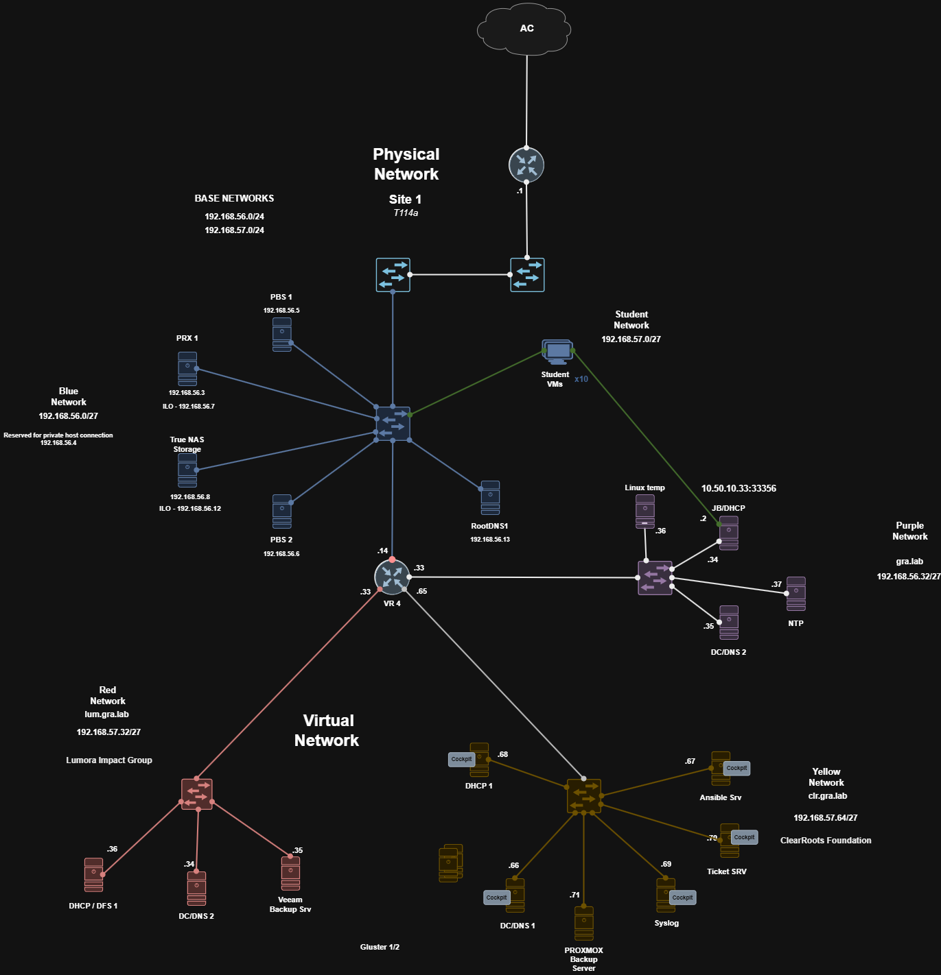
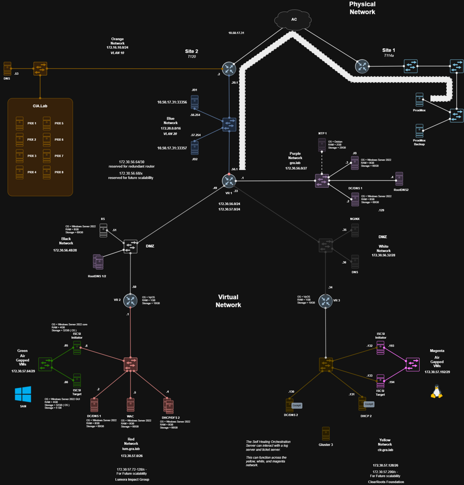
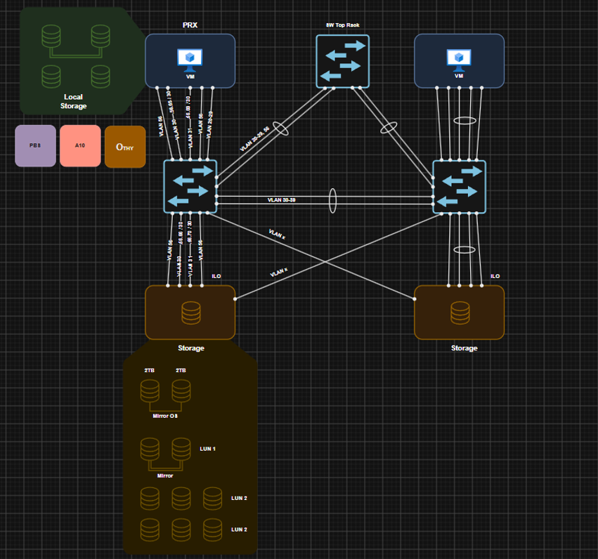

# Team Gravis — Multi-Site Cloud Infrastructure Lab

## Overview
A collaborative academic project simulating a Managed Service Provider (MSP) supporting two client environments across separate network sites. The lab covers virtualization, network segmentation, routing, directory services, storage, and secure site-to-site connectivity.

Client names have been anonymized for public publication.

## Environment Summary

| Client | Platform Focus | Core Services |
|---|---|---|
| Client A | Windows-based | Active Directory, DNS, DHCP, DFS |
| Client B | Open-source / Linux-based | Linux services, web/DMZ hosting |

## Technologies Used
- Proxmox VE (virtualization)
- VyOS (routing, DHCP relay)
- Windows Server (AD DS, DNS, DHCP, DFS)
- Linux server services
- TrueNAS (storage)
- WireGuard (site-to-site connectivity)
- VLAN segmentation / multi-site network design

## Architecture Highlights
- Two-site network design with segmented VLANs per site
- Inter-site connectivity secured via WireGuard
- Centralized and relayed DHCP across routed subnets
- Domain services and DNS supporting the Windows-based client environment
- Dedicated DMZ segment for externally facing services

  ## Topology Diagrams

The repository includes three topology diagrams that document the private infrastructure, public/client-side infrastructure, and local storage design used in the lab.

### Figure 1 — Site 1 Topology


This diagram shows the private-side infrastructure of the environment, including Proxmox, storage, backup, and MSP support services hosted at Site 1.

### Figure 2 — Site 2 Topology


This diagram shows the public/client-side infrastructure, including segmented client networks, DMZ segments, SAN networks, and routed connectivity at Site 2.

### Figure 3 — Local Storage Topology


This diagram shows the storage-focused design used in the lab, including relationships between virtualization and storage infrastructure.

## My Contributions
- Deployed VyOS router virtual machines in the Proxmox environment
- Configured and validated DHCP relay across routed network segments
- Worked on Windows Server infrastructure services, including DHCP, DNS, and DFS
- Participated in multi-site service testing, troubleshooting, and documentation

## Team Scope
This was a collaborative academic project completed by Team Gravis. Routing architecture, firewall policy, VPN connectivity, directory services, storage, backup, Linux services, DMZ services, and final documentation were implemented collaboratively across the team.

## Repository Structure
```
team-gravis-cloud-infrastructure/
├── README.md
├── docs/
│   ├── architecture-overview.md
│   ├── network-plan.md
│   └── contribution-and-attribution.md
├── diagrams/
│   └── topology.png 
├── screenshots/
│   └── (pending permission)
└── configs/
    └── (sanitized snippets only)
```

## Status
Diagrams and screenshots will be added once team approval is confirmed.
